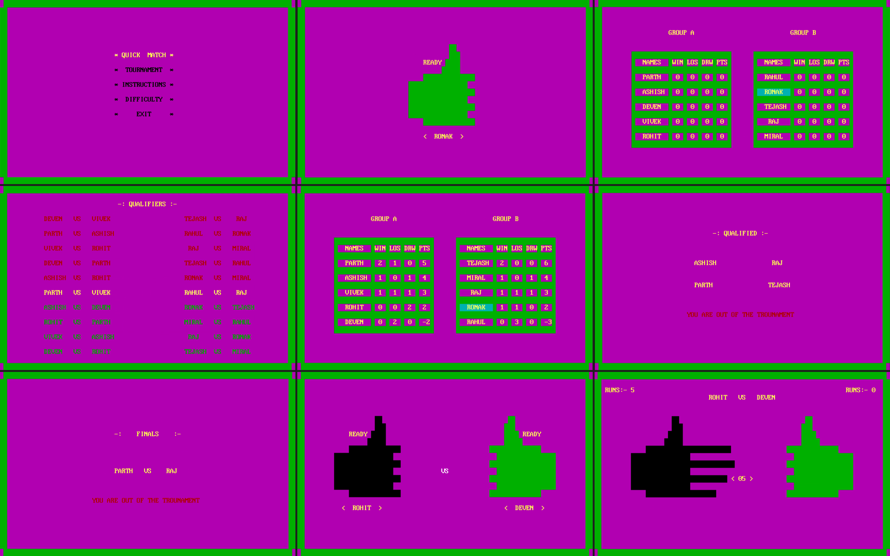

# OddEven-Turbo

## 📌 About

This is my first programming project, made using Turbo C++. 
The original version was text-based, and later I added some visuals using the conio.h header. 
This game is an original idea, inspired by a hand-sign-based cricket game we used to play during 5th grade.

## 🚀 Features

- Multiple game modes
- Choose your character
- Play against AI
- Different difficulty levels
- Basic code-based animations

 ## 🧾 Instructions

The executable file should run fine on Windows devices.
A Turbo C++ version is also included if you're interested in the code and want to check out my old work.
